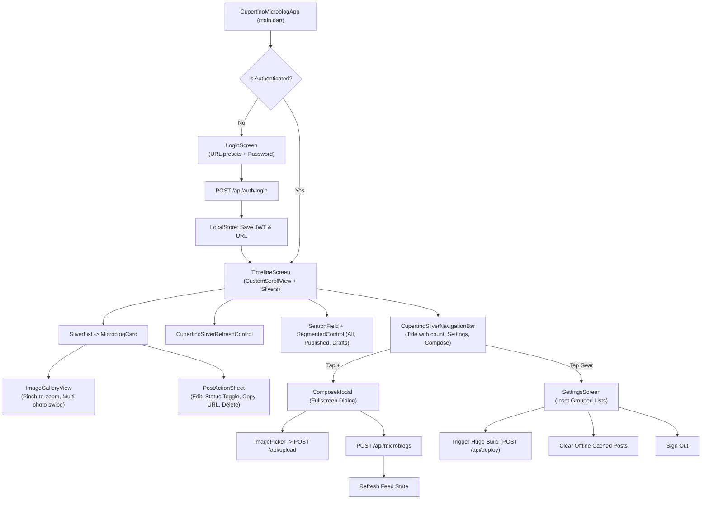

# Microblog Standalone Flutter Application — Architecture Blueprint & Handoff Document

> **Notice to Developers & AI Assistants**: This document is the definitive architectural blueprint and developer guide for the standalone Cupertino Microblog mobile application located in [`mobile-microblog/`](./mobile-microblog/).
> For general CMS backend architecture, read [`AI_HANDOFF.md`](./AI_HANDOFF.md).
> For Hugo static publishing details, read [`HUGO_CONTENT_ADAPTER.md`](./HUGO_CONTENT_ADAPTER.md).

---

## 1. Executive Summary & Design Philosophy

The **Cupertino Microblog App** (`mobile-microblog/`) is a dedicated, zero-bloat mobile and desktop client designed exclusively for fast, friction-free personal microblogging within the `admin-cms` Personal Knowledge Platform.

- **Strict Separation from Legacy Client**: The primary `android/` directory contains a full multi-module management app (covering Journal, Reading, Media, Locations, etc. with Material design). In contrast, `mobile-microblog/` is an **independent, isolated Flutter project** dedicated solely to short-form thoughts, quick photo capture, and instant publishing.
- **Pure Apple Cupertino Design Language**: Built strictly using Flutter's `Cupertino` widgets (`CupertinoApp`, `CupertinoSliverNavigationBar`, `CupertinoSliverRefreshControl`, `CupertinoSlidingSegmentedControl`, `CupertinoActionSheet`, `CupertinoListSection.insetGrouped`). No Material app bar or floating action button clutter.
- **Responsive Dynamic Theming**: Adaptive iOS Light and Dark mode using system dynamic colors (`AppCupertinoTheme`), subtle borders, and blur/translucent navigation chrome.
- **Offline-First Resilience**: Posts are locally cached via `SharedPreferences` for 0ms cold starts, while tokens are stored in `FlutterSecureStorage`.
- **Direct Cloud & CMS Integration**: Authenticates via JWT (`/api/auth/login`), streams posts via `/api/microblogs`, directly uploads images to Cloudinary via `/api/upload`, and triggers static Hugo site builds via `/api/deploy`.

---

## 2. Directory Structure & File Map

```text
mobile-microblog/
├── analysis_options.yaml                  # Lint and code quality rules
├── pubspec.yaml                           # Flutter dependencies & metadata
├── android/                               # Native Android runner & Gradle build configs
│   └── app/src/main/AndroidManifest.xml   # Network permissions & cleartext HTTP configuration
├── ios/                                   # Native iOS runner & Xcode project
│   └── Runner/Info.plist                  # ATS arbitrary loads configuration
├── macos/                                 # Native macOS runner
│   └── Runner/*.entitlements              # Network client sandbox entitlements
├── lib/
│   ├── main.dart                          # App bootstrap & session auth gate
│   ├── core/
│   │   ├── models/
│   │   │   └── microblog_post.dart        # MicroblogPost & MicroblogFetchResult models
│   │   ├── network/
│   │   │   └── api_service.dart           # HTTP REST client (Auth, Posts, Upload, Deploy)
│   │   ├── storage/
│   │   │   └── local_store.dart           # Secure storage & persistent offline cache
│   │   └── theme/
│   │       └── cupertino_theme.dart       # Dynamic Light/Dark iOS Cupertino design tokens
│   ├── screens/
│   │   ├── compose_modal.dart             # Fast modal thought & image composer
│   │   ├── login_screen.dart              # Cupertino authentication screen with URL presets
│   │   ├── settings_screen.dart           # Inset-grouped settings, cache & deployment hub
│   │   └── timeline_screen.dart           # Primary sliver timeline feed, search & filters
│   └── widgets/
│       ├── image_gallery_view.dart        # Full-screen pinch-to-zoom photo lightbox
│       ├── microblog_card.dart            # iOS card widget with markdown & thumbnail grid
│       └── post_action_sheet.dart         # Action sheet for status, edit, share, and delete
└── test/
    └── widget_test.dart                   # 10 comprehensive unit & widget tests
```

---

## 3. High-Level Architecture & Flow



---

## 4. Screen-by-Screen Reference

### 4.1 Authentication Gate & Login (`lib/screens/login_screen.dart`)
- **Visuals**: Centered iOS card with app glyph gradient, title, and form fields.
- **Server URL Configuration**:
  - Automatically defaults using `LocalStore.defaultServerUrl`:
    - Android: `http://10.0.2.2:3000` (loopback to host workstation).
    - Desktop / iOS Simulator: `http://localhost:3000`.
  - Includes **one-tap preset chips** under the input to switch between `localhost:3000` and `10.0.2.2:3000 (Emulator)`.
- **Password Input**: Clean `CupertinoTextField` with prefix lock icon and eye toggle for password obscurity.
- **Error Handling**: Displays inline error banner with descriptive network/auth errors.

### 4.2 Timeline Feed (`lib/screens/timeline_screen.dart`)
- **Navigation Chrome**: Translucent `CupertinoSliverNavigationBar` with large collapsing title showing real-time total count (e.g. `Microblog (42)`).
  - Left leading: Gear icon navigates to `SettingsScreen`.
  - Right trailing: Plus icon opens `ComposeModal`.
- **Pull-to-Refresh**: Native `CupertinoSliverRefreshControl` with bounce physics.
- **Search & Filters**:
  - `CupertinoSearchTextField` with real-time query debounce (350ms).
  - `CupertinoSlidingSegmentedControl` with `All`, `Published`, and `Drafts`.
- **Infinite Scroll Pagination**: Automatically triggers next page load when scrolled within 200px of the list bottom.
- **Empty & Loading States**: Clean `CupertinoActivityIndicator` on initial load and empty state graphics with a "Write Your First Post" quick action.

### 4.3 Social Micro-Cards (`lib/widgets/microblog_card.dart`)
- **Card Design**: Rounded card (`border-radius: 16px`) with dynamic system background and subtle border.
- **Header**:
  - Status badge pill: Green dot for `Published`, Orange dot for `Draft`.
  - Relative time stamp: "Just now", "5m ago", "3h ago", "Yesterday", or "MMM d, yyyy".
  - Trailing ellipsis icon button to invoke `PostActionSheet`.
- **Body**: Formatted Markdown via `flutter_markdown` with customized Cupertino text styling, monospace code blocks, and clickable links.
- **Photo Grid**:
  - Single image: 16:9 rounded cover image.
  - 2 to 4 images: 2-column square preview grid with `+N` badge if more than 4 images are attached.
  - Tapping any image opens `ImageGalleryView`.
- **Tags**: Horizontal wrap of `#tag` pills.

### 4.4 Full-Screen Image Lightbox (`lib/widgets/image_gallery_view.dart`)
- Fullscreen dialog presented with dark translucent navigation bar.
- Uses `InteractiveViewer` with pinch-to-zoom (0.8x to 3.5x scale).
- Swipeable `PageView.builder` with index counter (`1 of 3`).
- Cached network image loading with activity spinner and error fallbacks.

### 4.5 Action Sheet (`lib/widgets/post_action_sheet.dart`)
- Invoked with subtle iOS haptic feedback (`HapticFeedback.lightImpact()`).
- Options:
  1. **Edit Post**: Opens `ComposeModal` preloaded with the post's data.
  2. **Toggle Status**: Instantly switches status between `draft` and `published` without entering the editor.
  3. **Copy Short URL**: Copies `post.shortUrl` to system clipboard.
  4. **Delete Post**: Marked with `isDestructiveAction: true` and requires confirmation via `CupertinoAlertDialog`.

### 4.6 Fast Modal Composer (`lib/screens/compose_modal.dart`)
- Presented as an iOS modal sheet with `Cancel` (dismiss) and `Publish` / `Save Draft` actions.
- Segmented status switch: `Publish Instantly` vs `Draft`.
- Autogrowing `CupertinoTextField` with multiline support and live word/character counters.
- **Image Attachments**: Action sheet to pick from Photo Library or Camera (`image_picker`), automatically uploading bytes to `/api/upload` on Cloudinary and displaying horizontal thumbnail strip with deletion buttons.
- **Tag Manager**: Tag input with Enter submission and tag chip wrap.
- Validation: Prevents empty posts from being submitted.

### 4.7 Inset-Grouped Settings (`lib/screens/settings_screen.dart`)
- Formatted with `CupertinoListSection.insetGrouped`:
  - **Server Connection**: Shows current server URL; tapping opens edit dialog.
  - **Rebuild Hugo Site**: One-tap trigger for `/api/deploy` with loading indicator.
  - **Storage & Cache**: Displays number of cached posts and offers a "Clear Cache" action.
  - **About**: App version (`1.0.0`) and target description.
  - **Sign Out**: Destructive action removing saved credentials and returning to `LoginScreen`.

---

## 5. Backend REST API Contracts

The app connects directly to the Next.js API routes defined in `src/app/api/`:

| Operation | Method | Endpoint | Headers | Request / Query | Response Body |
|:---|:---:|:---|:---|:---|:---|
| **Login** | `POST` | `/api/auth/login` | `Content-Type: application/json` | `{"password": "..."}` | `{"success": true, "token": "...", "message": "..."}` |
| **List Posts** | `GET` | `/api/microblogs` | `Authorization: Bearer <token>` | `?search=...&status=all|published|draft&page=1&limit=25` | `{"items": [...], "total": 42, "page": 1, "totalPages": 2}` |
| **Create/Edit** | `POST` | `/api/microblogs` | `Authorization: Bearer <token>` | `{"id": "optional", "contentMarkdown": "...", "status": "...", "tags": [...], "images": [...]}` | Created/Updated post JSON object |
| **Delete Post** | `DELETE` | `/api/microblogs/[id]` | `Authorization: Bearer <token>` | URL parameter `id` | `{"success": true}` (HTTP 200) |
| **Upload Image**| `POST` | `/api/upload` | `Authorization: Bearer <token>` | Multipart file field `file` | `{"url": "https://res.cloudinary.com/..."}` |
| **Deploy Site** | `POST` | `/api/deploy` | `Authorization: Bearer <token>` | Empty | `{"success": true}` |

---

## 6. Network & Platform Security Configuration

To enable network communication across Android, iOS, and macOS platforms:

### Android (`android/app/src/main/AndroidManifest.xml`)
```xml
<manifest xmlns:android="http://schemas.android.com/apk/res/android">
    <uses-permission android:name="android.permission.INTERNET"/>
    <uses-permission android:name="android.permission.ACCESS_NETWORK_STATE"/>
    <application
        android:label="Microblog"
        android:name="${applicationName}"
        android:icon="@mipmap/ic_launcher"
        android:usesCleartextTraffic="true">
        ...
    </application>
</manifest>
```

### iOS (`ios/Runner/Info.plist`)
```xml
<key>NSAppTransportSecurity</key>
<dict>
    <key>NSAllowsArbitraryLoads</key>
    <true/>
</dict>
```

### macOS (`macos/Runner/DebugProfile.entitlements` & `Release.entitlements`)
```xml
<dict>
    <key>com.apple.security.app-sandbox</key>
    <true/>
    <key>com.apple.security.network.client</key>
    <true/>
</dict>
```

---

## 7. CI/CD & Build Automation

### 7.1 GitHub Actions Workflow (`.github/workflows/build-microblog-apk.yml`)
- Triggers on `push` to `main` (paths: `mobile-microblog/**`), `pull_request`, or manual `workflow_dispatch`.
- Sets up Java 17 Temurin and Flutter stable channel.
- Runs `flutter analyze` and `flutter test`.
- Builds ARM64 release APK:
  ```bash
  flutter build apk --release --target-platform android-arm64
  ```
- Uploads the resulting APK as artifact `microblog-arm64-release`.

### 7.2 CircleCI Pipeline (`.circleci/config.yml`)
- Includes dedicated job `build_microblog_apk_arm64`:
  - Runs on `cimg/android:2026.07-ndk`.
  - Runs `flutter analyze` and `flutter test`.
  - Builds `--release --target-platform android-arm64`.
  - Stores artifact `microblog-arm64-release.apk`.

---

## 8. Developer Commands Cheat Sheet

### Environment Setup
Flutter SDK path:
```bash
export PATH="/home/dog/flutter/bin:$PATH"
```

### Dependency Management & Static Analysis
```bash
cd mobile-microblog
flutter pub get
flutter analyze
```

### Execute Test Suite
```bash
cd mobile-microblog
flutter test
```
*Current test suite: 10 unit & widget tests covering model serialization, card layout, compose counters, pre-filling, and settings.*

### Run Application Locally
```bash
# Run on Linux Desktop
cd mobile-microblog
flutter run -d linux

# Run on Android Emulator / Connected Device
cd mobile-microblog
flutter run -d android
```

### Build ARM64 Release APK Manually
```bash
cd mobile-microblog
flutter build apk --release --target-platform android-arm64
# APK Output path:
# mobile-microblog/build/app/outputs/flutter-apk/app-release.apk
```

---

## 9. Verification & Health Checklist

When making future changes to `mobile-microblog/`, verify:
1. **Existing App Untouched**: Ensure `git status android/` remains clean.
2. **Analysis Passes**: `flutter analyze` must report zero issues.
3. **Tests Pass**: `flutter test` must pass 100% of tests.
4. **Backend Tests Pass**: Run `npm test` from root to guarantee no regressions on the Next.js API endpoints.
5. **Update Documentation**: Keep this file (`MICROBLOG_APP_HANDOFF.md`) and `AI_HANDOFF.md` updated with any new models, endpoints, or UI screens.
