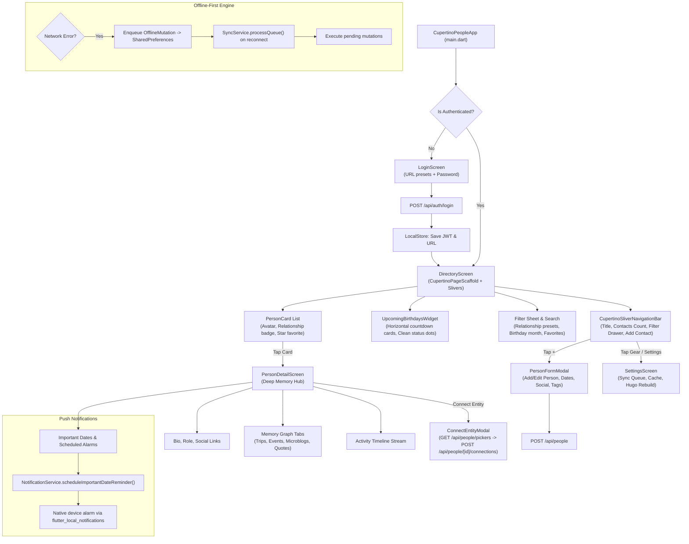

# People & Memory Hub Standalone Flutter Application — Architecture Blueprint & Handoff Document

> **Notice to Developers & AI Assistants**: This document is the definitive architectural blueprint and developer guide for the standalone Cupertino People & Memory Hub mobile application located in [`mobile-people/`](./mobile-people/).
> For general CMS backend architecture, read [`AI_HANDOFF.md`](./AI_HANDOFF.md).
> For the standalone Microblog client, read [`MICROBLOG_APP_HANDOFF.md`](./MICROBLOG_APP_HANDOFF.md).
> For Hugo static publishing details, read [`HUGO_CONTENT_ADAPTER.md`](./HUGO_CONTENT_ADAPTER.md).

---

## 1. Executive Summary & Design Philosophy

The **Cupertino People App** (`mobile-people/`) is a dedicated, high-performance mobile application providing **1:1 feature parity** with the `admin-cms` webapp's People & Memory Hub module (`/people` and `/people/[slug]`).

- **Strict Separation from Legacy Client**: The primary `android/` directory contains a full legacy multi-module management app (Material design). In contrast, `mobile-people/` is an **independent, isolated Flutter project** adhering strictly to Apple's modern Cupertino design system. Never modify or regress `android/` when working on `mobile-people/`.
- **Pure Apple Cupertino Design System**:
  - Built strictly with Flutter's Cupertino widgets (`CupertinoApp`, `CupertinoPageScaffold`, `CupertinoSliverNavigationBar`, `CupertinoSearchTextField`, `CupertinoActionSheet`, `CupertinoListSection.insetGrouped`).
  - Native iOS dynamic colors (`AppCupertinoTheme`), adaptive grouped backgrounds, crisp border dividers, and subtle pill fills.
  - Large title sliver navigation with collapsing title, contact count badge, offline pending sync badge, and filter drawer toggle.
- **Master-Detail Memory Hub Flow**: Fluid directory list with filter chips (Relationship presets, Birthday months, Favorites, Search), smoothly transitioning to a deep `PersonDetailScreen` featuring personal memory graphs, connected trips, events, microblogs, quotes, and chronological activity timelines.
- **Important Dates & Birthday Reminders**:
  - Horizontal scrollable upcoming countdown tray (`UpcomingBirthdaysWidget`) with clean color-coded status dot indicators.
  - Native device push notifications via `flutter_local_notifications` for dates marked with `reminderEnabled: true`.
- **Entity Connection Engine**: Bi-directional entity connection modal (`ConnectEntityModal`) allowing immediate linkage to Locations, Trips, Projects, Microblogs, Photos, and Collections.
- **Offline-First Resilience**: Full mutation queue with persistent background sync (`SyncService`, `LocalStore`), local cache fallback, and Hugo rebuild trigger hook.

---

## 2. Directory Structure & File Map

```text
mobile-people/
├── analysis_options.yaml                  # Lint and code quality rules (flutter_lints)
├── pubspec.yaml                           # Flutter dependencies & metadata
├── android/                               # Native Android runner & Gradle build configs
│   ├── app/build.gradle.kts               # Android build config & keystore signing
│   └── app/src/main/AndroidManifest.xml   # Network permissions, POST_NOTIFICATIONS, VIBRATE
├── ios/                                   # Native iOS runner & Xcode project
│   └── Runner/Info.plist                  # ATS arbitrary loads & permissions
├── macos/                                 # Native macOS runner
│   └── Runner/*.entitlements              # Network client sandbox entitlements
├── lib/
│   ├── main.dart                          # App bootstrap & session auth gate
│   ├── core/
│   │   ├── models/
│   │   │   ├── important_date.dart        # ImportantDate model (recurrence, countdown, notifications)
│   │   │   ├── social_links.dart          # SocialLinks model & URL helpers (GitHub, X, LinkedIn, etc.)
│   │   │   ├── person_record.dart         # PersonRecord model, initials, relationship colors, copyWith
│   │   │   ├── person_connections.dart    # PersonConnections composite model (photos, trips, etc.)
│   │   │   ├── person_timeline_item.dart  # PersonTimelineItem composite timeline model
│   │   │   ├── upcoming_birthday_item.dart# UpcomingBirthdayItem model with countdown badges
│   │   │   ├── picker_items.dart          # PeoplePickersResult & PickerItem models for fast connections
│   │   │   └── offline_mutation.dart      # OfflineMutation model for offline queue serialization
│   │   ├── network/
│   │   │   ├── api_service.dart           # HTTP REST client (Auth, People, Memory Hub, Pickers, Deploy)
│   │   │   └── sync_service.dart          # Offline-first background synchronization worker
│   │   ├── services/
│   │   │   └── notification_service.dart  # Local push notifications & scheduled birthday alarms
│   │   ├── storage/
│   │   │   └── local_store.dart           # Secure storage, preferences, mutation queue & local cache
│   │   └── theme/
│   │       └── cupertino_theme.dart       # Dynamic Light/Dark iOS Cupertino design tokens
│   ├── screens/
│   │   ├── connect_entity_modal.dart      # Multi-entity picker modal (Locations, Trips, Projects, etc.)
│   │   ├── directory_screen.dart          # Cupertino sliver directory, filters, birthday tray & contacts list
│   │   ├── login_screen.dart              # Cupertino authentication screen with URL presets
│   │   ├── person_detail_screen.dart      # Deep Memory Hub screen (Bio, Dates, Connections, Timeline)
│   │   ├── person_form_modal.dart         # Full CRUD add/edit modal (Dates editor, Social, Tags)
│   │   └── settings_screen.dart           # Inset-grouped settings, queue & deployment
│   └── widgets/
│       ├── image_lightbox.dart            # Full-screen pinch-to-zoom avatar/image viewer
│       ├── person_card.dart               # Clean Cupertino person card with badges & quick actions
│       └── upcoming_birthdays_widget.dart # Horizontal upcoming birthdays & important dates countdown tray
└── test/
    └── widget_test.dart                   # 20 comprehensive unit & widget tests (100% passing)
```

---

## 3. High-Level Architecture & Flow



---

## 4. Screen-by-Screen Reference

### 4.1 Authentication Gate & Login (`lib/screens/login_screen.dart`)
- **Visuals**: Centered iOS card with app glyph gradient, title, and form fields.
- **Server URL Configuration**:
  - Automatically defaults using `LocalStore.defaultServerUrl`:
    - Android: `http://10.0.2.2:3000` (loopback to host workstation).
    - Desktop / iOS Simulator: `http://localhost:3000`.
  - Includes **one-tap preset chips** under the input to switch between `localhost:3000` and `10.0.2.2:3000 (Emulator)`.
- **Password Input**: Clean `CupertinoTextField` with prefix lock icon and eye toggle for password obscurity.
- **Error Handling**: Displays inline error banner with descriptive network/auth errors.

### 4.2 Directory Screen (`lib/screens/directory_screen.dart`)
- **Navigation Bar**: `CupertinoSliverNavigationBar` with large title, contact count capsule badge, offline pending sync indicator, filter drawer toggle, and quick-add button.
- **Upcoming Birthdays Tray**: `UpcomingBirthdaysWidget` displaying a horizontal scrollable strip of birthdays within 60 days with countdown badges (`in X days`, `Today!`) and color-coded status dot indicators. Tapping a card opens that person's detail screen.
- **Filter Sheet & Search**:
  - Slide-out filter panel with relationship pills (`All`, `Family`, `Close Friend`, `Friend`, `Professional`, `Mentor`, `Acquaintance`), birthday month selector (`Jan` through `Dec`), and favorites toggle.
  - Real-time debounced search query field pinned below the large navigation bar.
- **Contact Cards**: Rendered with `PersonCard` featuring avatar initials, name, relationship tint, primary birthday badge, and instant favorite toggle. Long-pressing brings up a native `CupertinoActionSheet` (Edit, Delete, Copy link).

### 4.3 Person Detail & Memory Hub (`lib/screens/person_detail_screen.dart`)
- **Profile Header**: Clean Cupertino card with large avatar (tapping opens `ImageLightbox`), relationship pill, favorite star toggle, and action buttons (Edit, Connect Entity, Delete).
- **Important Dates Section**: Lists all anniversary and birthday dates with countdown badges, recurrence rules, and native reminder switch (`NotificationService`).
- **Social Links Strip**: One-tap buttons for GitHub, Twitter/X, LinkedIn, Instagram, and Website opening via `url_launcher`.
- **Notes & Bio**: Formatted Markdown notes rendered via `flutter_markdown`.
- **Interconnected Memory Hub**: Segmented control switching between connected entities:
  - ✈️ **Trips**: List of trips shared with this person.
  - 📅 **Events / Projects**: Projects and events connected to this person.
  - 💬 **Microblogs**: Microblog posts mentioning this person.
  - 📜 **Quotes & Notes**: Quotes attributed to this person.
- **Activity Timeline**: Chronological stream of life events, dates, and interactions connected to the person with color-coded node indicators.

### 4.4 Person Form Modal (`lib/screens/person_form_modal.dart`)
- Fullscreen Cupertino modal with `Cancel` and `Save` buttons.
- Form fields:
  - Display Name, First Name, Last Name, Nickname, Avatar URL.
  - Relationship selector: Segmented picker with presets.
  - Important Dates Editor: Dynamic list with title, date picker, notes, and notification reminder toggle.
  - Social Links: Instagram, Twitter/X, GitHub, LinkedIn, Website.
  - Interests and Tags: Comma-separated tokenized inputs.
  - Notes: Multiline Markdown editor.
  - Visibility: `private`, `unlisted`, `public`.

### 4.5 Connect Entity Modal (`lib/screens/connect_entity_modal.dart`)
- Loads multi-entity choices via `/api/people/pickers` in 1 single roundtrip.
- Category tabs: Locations, Trips, Projects, Microblogs, Photos, Collections.
- Search filter for quickly finding items.
- Configures relationship name (e.g. `visited`, `joined`, `worked_on`, `mentions`).
- Dispatches connection mutation to `/api/people/[id]/connections`.

### 4.6 Settings Screen (`lib/screens/settings_screen.dart`)
- Inset-grouped settings list:
  - **Server Connection**: URL configuration and latency test.
  - **Offline & Sync Queue**: Displays count of pending offline mutations with manual "Sync Now" button.
  - **Cached Contacts**: Local cache counter and "Clear Cache" button.
  - **Push Reminders**: Test notification button triggering an immediate test push.
  - **Static Hugo Publishing**: Rebuild Hugo site button triggering `VERCEL_DEPLOY_HOOK`.
  - **Account**: App version info and Sign Out.

---

## 5. Backend REST API Endpoints Reference

The app communicates with the following Next.js REST API endpoints:

| Endpoint | Method | Description |
| :--- | :--- | :--- |
| `/api/auth/login` | `POST` | Authenticates user with CMS password, returns session token. |
| `/api/people` | `GET` | Searches and filters persons with pagination (`search`, `relationship`, `tags`, `limit`, `page`). |
| `/api/people` | `POST` | Creates or updates a person record with full Zod validation. |
| `/api/people/[id]` | `GET` | Returns full composite Memory Hub payload (person details, connected trips, events, microblogs, quotes, activity timeline). |
| `/api/people/[id]` | `PUT` | Updates an existing person record. |
| `/api/people/[id]` | `DELETE` | Deletes a person record and cleans up associations. |
| `/api/people/[id]/favorite` | `POST` | Toggles person favorite flag. |
| `/api/people/[id]/connections` | `POST` | Connects an entity (location, trip, project, microblog, photo, collection) to the person. |
| `/api/people/[id]/connections` | `DELETE` | Disconnects an entity relationship. |
| `/api/people/birthdays` | `GET` | Fetches upcoming birthdays within 60 days with age calculation and days remaining. |
| `/api/people/pickers` | `GET` | Fetches all connectable entities in 1 query for the connection modal. |
| `/api/deploy` | `POST` | Triggers background `VERCEL_DEPLOY_HOOK` for Hugo rebuild. |

---

## 6. Offline-First Synchronization & Push Notifications

### 6.1 Mutation Queue Architecture
- When an operation (create person, update person, delete person, toggle favorite, add connection, remove connection) is performed without internet connectivity:
  1. The UI optimistically updates local state.
  2. The mutation is saved to `LocalStore.enqueueMutation()` in `SharedPreferences`.
  3. The `CupertinoSliverNavigationBar` displays an orange badge indicating pending sync count.
  4. When connectivity resumes or the user taps "Sync Now" in Settings, `SyncService.processQueue()` executes the queued mutations sequentially in FIFO order.

### 6.2 Native Push Notifications
- Integrated via `flutter_local_notifications: ^19.0.0`.
- Supports Android 13+ runtime permissions (`POST_NOTIFICATIONS`) and iOS/macOS alert permissions.
- When an important date has `reminderEnabled: true`, the app calculates the next occurrence and schedules a local notification on the device.

---

## 7. Verification & Quality Gates

Run all automated checks prior to committing:

```bash
# 1. Mobile People App (Flutter)
cd mobile-people
export PATH="/home/dog/flutter/bin:$PATH"
flutter analyze    # Must report 0 issues
flutter test       # Must pass 100% of tests (20/20 tests passing)

# 2. Mobile Microblog App (verify no regression)
cd mobile-microblog
export PATH="/home/dog/flutter/bin:$PATH"
flutter analyze    # Must report 0 issues
flutter test       # Must pass 100% of tests (13/13 tests passing)

# 3. Next.js & Backend CMS Vitest Suite
npm test           # Must pass 100% of Vitest suites (67/67 tests passing)

# 4. Strict Subsystem Isolation Check
git status android/ # Must remain completely clean!
```

---

## 8. CI/CD Pipeline (GitHub Actions & CircleCI)

### 8.1 GitHub Actions Workflow (`.github/workflows/build-people-apk.yml`)
- **Trigger**: Automatic on pushes and PRs touching `mobile-people/**` or `.github/workflows/build-people-apk.yml`, plus manual trigger via `workflow_dispatch`.
- **Environment**: `ubuntu-latest` with Java 17 (Temurin) and Flutter stable (cached).
- **Quality Gates**: Runs `flutter pub get`, `flutter analyze` (0 issues enforced), and `flutter test` (100% passing).
- **Keystore Automation**: Decodes and mounts release keystore if secrets are set (`KEYSTORE_BASE64` or `ANDROID_KEYSTORE_BASE64`, `KEYSTORE_PASSWORD`, `KEY_ALIAS`, `KEY_PASSWORD`) in `key.properties`, falling back gracefully to debug signing.
- **Build & Artifact**: Executes `flutter build apk --release --target-platform android-arm64` and publishes artifact `people-arm64-release`.

### 8.2 CircleCI Configuration (`.circleci/config.yml`)
- **Job**: `build_people_apk_arm64` (Docker image: `cimg/android:2026.07-ndk`).
- **Steps**: Installs Flutter SDK, runs static analysis & test suites, configures keystore, builds ARM64 release APK, and stores `people-arm64-release.apk`.

---

## 9. Recent Updates & Architectural Changelog

### Version 1.1.0 — De-bloat & Clean Cupertino Modernization (September 2026)

1. **Complete Removal of Liquid Glass Effects**:
   - Removed `liquid_glass_theme.dart`, `liquid_glass_container.dart`, `ambient_mesh_background.dart`, and `floating_glass_header.dart`.
   - Eliminated heavy GPU backdrop blur filters, multi-layered mesh gradients, and specular bevel shaders.
   - Removed redundant "Liquid Glass Effects" toggle from `SettingsScreen` and `LocalStore`.

2. **Native Cupertino Architecture Restored**:
   - Directory screen uses `CupertinoPageScaffold` and `CupertinoSliverNavigationBar` with large collapsing title, contact count capsule, offline pending sync badge, filter drawer toggle, and quick-add action.
   - Restored `PersonCard`, `UpcomingBirthdaysWidget`, `ConnectEntityModal`, and `PersonDetailScreen` to use `AppCupertinoTheme.cardBackground`, dynamic borders, and subtle fills.
   - Upcoming birthday countdown replaces jewel glow with clean solid indicator dots (`UpcomingBirthdaysWidget.getCountdownColor`).

3. **Performance & Verification**:
   - `flutter analyze` reports zero issues.
   - 20/20 unit and widget tests passing in `test/widget_test.dart`.

