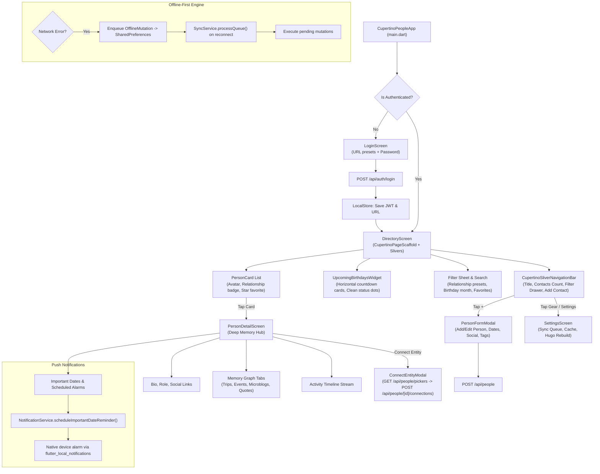

# People & Memory Hub Standalone Flutter Application — Architecture Blueprint & Handoff Document

> **Notice to Developers & AI Assistants**: This document is the definitive architectural blueprint and developer guide for the standalone Cupertino People & Memory Hub mobile application located in [`mobile-people/`](./mobile-people/).
> For general CMS backend architecture, read [`AI_HANDOFF.md`](./AI_HANDOFF.md).
> For the standalone Microblog client, read [`MICROBLOG_APP_HANDOFF.md`](./MICROBLOG_APP_HANDOFF.md).
> For Hugo static publishing details, read [`HUGO_CONTENT_ADAPTER.md`](./HUGO_CONTENT_ADAPTER.md).

---

## 1. Executive Summary & Design Philosophy

The **Cupertino People App** (`mobile-people/`) is a dedicated, high-performance mobile application providing **1:1 feature parity** with the `admin-cms` webapp's People & Memory Hub module (`/people` and `/people/[slug]`).

- **Strict Separation from Legacy Client**: The primary `android/` directory contains a full legacy multi-module management app (Material design). In contrast, `mobile-people/` is an **independent, isolated Flutter project** adhering strictly to Apple's modern Cupertino design system. Never modify or regress `android/` when working on `mobile-people/`.
- **Pure Apple Cupertino Design System**:
  - Built strictly with Flutter's Cupertino widgets (`CupertinoApp`, `CupertinoPageScaffold`, `CupertinoSliverNavigationBar`, `CupertinoSearchTextField`, `CupertinoActionSheet`, `CupertinoListSection.insetGrouped`).
  - Native iOS dynamic colors (`AppCupertinoTheme`), adaptive grouped backgrounds, crisp border dividers, and subtle pill fills.
  - Large title sliver navigation with collapsing title, contact count badge, offline pending sync badge, and filter drawer toggle.
- **Master-Detail Memory Hub Flow**: Fluid directory list with filter chips (Relationship presets, Birthday months, Favorites, Search), smoothly transitioning to a deep `PersonDetailScreen` featuring personal memory graphs, connected trips, events, microblogs, quotes, and chronological activity timelines.
- **Important Dates & Birthday Reminders**:
  - Horizontal scrollable upcoming countdown tray (`UpcomingBirthdaysWidget`) with clean color-coded status dot indicators.
  - Native device push notifications via `flutter_local_notifications` for dates marked with `reminderEnabled: true`.
- **Entity Connection Engine**: Bi-directional entity connection modal (`ConnectEntityModal`) allowing immediate linkage to Locations, Trips, Projects, Microblogs, Photos, and Collections.
- **Offline-First Resilience**: Full mutation queue with persistent background sync (`SyncService`, `LocalStore`), local cache fallback, and Hugo rebuild trigger hook.

---

## 2. Directory Structure & File Map

```text
mobile-people/
├── analysis_options.yaml                  # Lint and code quality rules (flutter_lints)
├── pubspec.yaml                           # Flutter dependencies & metadata
├── android/                               # Native Android runner & Gradle build configs
│   ├── app/build.gradle.kts               # Android build config & keystore signing
│   └── app/src/main/AndroidManifest.xml   # Network permissions, POST_NOTIFICATIONS, VIBRATE
├── ios/                                   # Native iOS runner & Xcode project
│   └── Runner/Info.plist                  # ATS arbitrary loads & permissions
├── macos/                                 # Native macOS runner
│   └── Runner/*.entitlements              # Network client sandbox entitlements
├── lib/
│   ├── main.dart                          # App bootstrap & session auth gate
│   ├── core/
│   │   ├── models/
│   │   │   ├── important_date.dart        # ImportantDate model (recurrence, countdown, notifications)
│   │   │   ├── social_links.dart          # SocialLinks model & URL helpers (GitHub, X, LinkedIn, etc.)
│   │   │   ├── person_record.dart         # PersonRecord model, initials, relationship colors, copyWith
│   │   │   ├── person_connections.dart    # PersonConnections composite model (photos, trips, etc.)
│   │   │   ├── person_timeline_item.dart  # PersonTimelineItem composite timeline model
│   │   │   ├── upcoming_birthday_item.dart# UpcomingBirthdayItem model with countdown badges
│   │   │   ├── picker_items.dart          # PeoplePickersResult & PickerItem models for fast connections
│   │   │   └── offline_mutation.dart      # OfflineMutation model for offline queue serialization
│   │   ├── network/
│   │   │   ├── api_service.dart           # HTTP REST client (Auth, People, Memory Hub, Pickers, Deploy)
│   │   │   └── sync_service.dart          # Offline-first background synchronization worker
│   │   ├── services/
│   │   │   ├── image_cache_manager.dart   # Dedicated PeopleImageCacheManager (90-day disk cache, pre-cacher)
│   │   │   └── notification_service.dart  # Local push notifications & scheduled birthday alarms
│   │   ├── storage/
│   │   │   └── local_store.dart           # Secure storage, 7-day TTL, mutation queue, optimistic CRUD & local cache
│   │   └── theme/
│   │       └── cupertino_theme.dart       # Dynamic Light/Dark iOS Cupertino design tokens
│   ├── screens/
│   │   ├── connect_entity_modal.dart      # Multi-entity picker modal (Locations, Trips, Projects, etc.)
│   │   ├── directory_screen.dart          # Cupertino sliver directory, search, filter sheet & contacts list
│   │   ├── login_screen.dart              # Cupertino authentication screen with URL presets
│   │   ├── main_navigation_screen.dart    # Native 2-tab Cupertino tab bar (People, Settings)
│   │   ├── person_detail_screen.dart      # Deep Memory Hub screen (Bio, Dates, Connections, Timeline)
│   │   ├── person_form_modal.dart         # Full CRUD add/edit modal (Dates editor, Social, Tags)
│   │   ├── photo_picker_modal.dart        # 3-Tab Photo Connection Modal (Gallery/R2, Cloudinary, Upload)
│   │   └── settings_screen.dart           # Inset-grouped settings, queue & deployment
│   └── widgets/
│       ├── image_lightbox.dart            # Full-screen pinch-to-zoom avatar/image viewer
│       ├── person_card.dart               # Clean Cupertino person list row with subtle metadata & star action
│       └── upcoming_birthdays_widget.dart # Compact Coming up cards with date badges & countdown pills
└── test/
    └── widget_test.dart                   # 35 comprehensive unit & widget tests (100% passing)
```

---

## 3. High-Level Architecture & Flow



---

## 4. Screen-by-Screen Reference

### 4.1 Authentication Gate & Login (`lib/screens/login_screen.dart`)
- **Visuals**: Centered iOS card with app glyph gradient, title, and form fields.
- **Server URL Configuration**:
  - Automatically defaults using `LocalStore.defaultServerUrl`:
    - Android: `http://10.0.2.2:3000` (loopback to host workstation).
    - Desktop / iOS Simulator: `http://localhost:3000`.
  - Includes **one-tap preset chips** under the input to switch between `localhost:3000` and `10.0.2.2:3000 (Emulator)`.
- **Password Input**: Clean `CupertinoTextField` with prefix lock icon and eye toggle for password obscurity.
- **Error Handling**: Displays inline error banner with descriptive network/auth errors.

### 4.2 Directory Screen (`lib/screens/directory_screen.dart`)
- **Navigation Bar**: `CupertinoSliverNavigationBar` with large title, contact count capsule badge, offline pending sync indicator, filter drawer toggle, and quick-add button.
- **Upcoming Birthdays Tray**: `UpcomingBirthdaysWidget` displaying a horizontal scrollable strip of birthdays within 60 days with countdown badges (`in X days`, `Today!`) and color-coded status dot indicators. Tapping a card opens that person's detail screen.
- **Filter Sheet & Search**:
  - Slide-out filter panel with relationship pills (`All`, `Family`, `Close Friend`, `Friend`, `Professional`, `Mentor`, `Acquaintance`), birthday month selector (`Jan` through `Dec`), and favorites toggle.
  - Real-time debounced search query field pinned below the large navigation bar.
- **Contact Cards**: Rendered with `PersonCard` featuring avatar initials, name, relationship tint, primary birthday badge, and instant favorite toggle. Long-pressing brings up a native `CupertinoActionSheet` (Edit, Delete, Copy link).

### 4.3 Person Detail & Memory Hub (`lib/screens/person_detail_screen.dart`)
- **Profile Header**: Clean Cupertino card with large avatar (tapping opens `ImageLightbox`), relationship pill, favorite star toggle, and action buttons (Edit, Connect Entity, Delete).
- **Important Dates Section**: Lists all anniversary and birthday dates with countdown badges, recurrence rules, and native reminder switch (`NotificationService`).
- **Social Links Strip**: One-tap buttons for GitHub, Twitter/X, LinkedIn, Instagram, and Website opening via `url_launcher`.
- **Notes & Bio**: Formatted Markdown notes rendered via `flutter_markdown`.
- **Interconnected Memory Hub**: Segmented control switching between connected entities:
  - ✈️ **Trips**: List of trips shared with this person.
  - 📅 **Events / Projects**: Projects and events connected to this person.
  - 💬 **Microblogs**: Microblog posts mentioning this person.
  - 📜 **Quotes & Notes**: Quotes attributed to this person.
- **Activity Timeline**: Chronological stream of life events, dates, and interactions connected to the person with color-coded node indicators.

### 4.4 Person Form Modal (`lib/screens/person_form_modal.dart`)
- Fullscreen Cupertino modal with `Cancel` and `Save` buttons.
- Form fields:
  - Display Name, First Name, Last Name, Nickname, Avatar URL.
  - Relationship selector: Segmented picker with presets.
  - Important Dates Editor: Dynamic list with title, date picker, notes, and notification reminder toggle.
  - Social Links: Instagram, Twitter/X, GitHub, LinkedIn, Website.
  - Interests and Tags: Comma-separated tokenized inputs.
  - Notes: Multiline Markdown editor.
  - Visibility: `private`, `unlisted`, `public`.

### 4.5 Connect Entity Modal (`lib/screens/connect_entity_modal.dart`)
- Loads multi-entity choices via `/api/people/pickers` in 1 single roundtrip.
- Category tabs: Locations, Trips, Projects, Microblogs, Photos, Collections.
- Search filter for quickly finding items.
- Configures relationship name (e.g. `visited`, `joined`, `worked_on`, `mentions`).
- Dispatches connection mutation to `/api/people/[id]/connections`.

### 4.6 Settings Screen (`lib/screens/settings_screen.dart`)
- Inset-grouped settings list:
  - **Server Connection**: URL configuration and latency test.
  - **Offline & Sync Queue**: Displays count of pending offline mutations with manual "Sync Now" button.
  - **Cached Contacts**: Local cache counter and "Clear Cache" button.
  - **Push Reminders**: Test notification button triggering an immediate test push.
  - **Static Hugo Publishing**: Rebuild Hugo site button triggering `VERCEL_DEPLOY_HOOK`.
  - **Account**: App version info and Sign Out.

---

## 5. Backend REST API Endpoints Reference

The app communicates with the following Next.js REST API endpoints:

| Endpoint | Method | Description |
| :--- | :--- | :--- |
| `/api/auth/login` | `POST` | Authenticates user with CMS password, returns session token. |
| `/api/people` | `GET` | Searches and filters persons with pagination (`search`, `relationship`, `tags`, `limit`, `page`). |
| `/api/people` | `POST` | Creates or updates a person record with full Zod validation. |
| `/api/people/[id]` | `GET` | Returns full composite Memory Hub payload (person details, connected trips, events, microblogs, quotes, activity timeline). |
| `/api/people/[id]` | `PUT` | Updates an existing person record. |
| `/api/people/[id]` | `DELETE` | Deletes a person record and cleans up associations. |
| `/api/people/[id]/favorite` | `POST` | Toggles person favorite flag. |
| `/api/people/[id]/connections` | `POST` | Connects an entity (location, trip, project, microblog, photo, collection) to the person. |
| `/api/people/[id]/connections` | `DELETE` | Disconnects an entity relationship. |
| `/api/people/birthdays` | `GET` | Fetches upcoming birthdays within 60 days with age calculation and days remaining. |
| `/api/people/pickers` | `GET` | Fetches all connectable entities in 1 query for the connection modal. |
| `/api/deploy` | `POST` | Triggers background `VERCEL_DEPLOY_HOOK` for Hugo rebuild. |

---

## 6. Offline-First Architecture & Push Notifications

### 6.1 7-Day TTL Cache-First Architecture & Network Policy
- **Offline-First Strategy**: The app prioritizes local disk cache for all read operations (`getPeople`, `getPersonDetail`, `getUpcomingBirthdays`, and `getPickers`).
- **7-Day Expiry Policy (`LocalStore.defaultCacheTtl = Duration(days: 7)`)**:
  - The app serves cached data immediately upon navigation with 0ms network latency.
  - Network requests are bypassed unless the cache is older than 7 days (`isPeopleCacheStale`, `isDetailCacheStale`, `isBirthdaysCacheStale`, `isPickersCacheStale`), an explicit pull-to-refresh (`CupertinoSliverRefreshControl(forceRefresh: true)`) is performed, or the user taps "Force Sync All" in Settings.
  - If network connectivity is unavailable when cache expires, the app gracefully falls back to existing cached data indefinitely.
  - Initial load retrieves up to 500 contacts (`limit=500`) in a single payload, ensuring complete circles are cached locally.

### 6.2 100% In-Memory Search, Sort & Filtering Engine
- **0ms Keystroke Latency**: Search queries in `DirectoryScreen` execute entirely client-side across the in-memory contact circle (`_applyFiltersAndSort`). No network requests are dispatched on keystrokes.
- **In-Memory Sort**: Supports instant switching between Sort by Name (A-Z / Z-A), Recently Updated, Recently Created, Next Birthday, and Age / Birth Year.
- **Compound Filters**: Combines search text, relationship filters, birthday month selections, and favorites filter with instantaneous results (<1ms execution time).

### 6.3 Persistent Disk Image Caching & Background Pre-Caching
- **`PeopleImageCacheManager`**: Dedicated cache manager extending `CacheManager` with key `'people_app_image_cache'`.
  - **90-Day Retention**: `stalePeriod: Duration(days: 90)` preserves avatars, thumbnails, and attached photos across app restarts.
  - **Capacity**: Holds up to 2,000 cached image files (`maxNrOfCacheObjects: 2000`).
  - **Background Pre-Caching**: Whenever contacts are loaded from cache or network, `PeopleImageCacheManager.precacheImages()` non-blockingly pre-downloads all contact avatars in the background.
  - **Uniform Usage**: Integrated into `PersonCard`, `PersonDetailScreen`, `UpcomingBirthdaysWidget`, `PhotoPickerModal`, `PersonFormModal`, and `ImageLightbox`.

### 6.4 Optimistic Local Mutations & Sync Queue
- **Instant Mutation Feedback**:
  - Creating or editing a contact immediately writes to `LocalStore.upsertCachedPerson()` and updates the UI.
  - Deleting a contact immediately removes it via `LocalStore.deleteCachedPerson()`.
  - Favoriting immediately updates `LocalStore.toggleCachedPersonFavorite()`.
- **FIFO Offline Queue**:
  - If offline, mutations are recorded to `LocalStore.enqueueMutation()` in `SharedPreferences`.
  - `CupertinoSliverNavigationBar` displays an orange badge indicating pending mutations count.
  - When connectivity resumes or the user taps "Sync Now" in Settings, `SyncService.processQueue()` processes queued mutations in order.

### 6.5 Native Push Notifications
- Integrated via `flutter_local_notifications: ^19.0.0`.
- Supports Android 13+ runtime permissions (`POST_NOTIFICATIONS`) and iOS/macOS alert permissions.
- When an important date has `reminderEnabled: true`, the app calculates the next occurrence and schedules a local notification on the device.

---

## 7. Verification & Quality Gates

Run all automated checks prior to committing:

```bash
# 1. Mobile People App (Flutter)
cd mobile-people
export PATH="/home/dog/flutter/bin:$PATH"
flutter analyze    # Must report 0 issues
flutter test       # Must pass 100% of tests (35/35 tests passing)

# 2. Mobile Microblog App (verify no regression)
cd mobile-microblog
export PATH="/home/dog/flutter/bin:$PATH"
flutter analyze    # Must report 0 issues
flutter test       # Must pass 100% of tests (13/13 tests passing)

# 3. Next.js & Backend CMS Vitest Suite
npm test           # Must pass 100% of Vitest suites (69/69 tests passing)

# 4. Strict Subsystem Isolation Check
git status android/ # Must remain completely clean!
```

---

## 8. CI/CD Pipeline (GitHub Actions & CircleCI)

### 8.1 GitHub Actions Workflow (`.github/workflows/build-people-apk.yml`)
- **Trigger**: Automatic on pushes and PRs touching `mobile-people/**` or `.github/workflows/build-people-apk.yml`, plus manual trigger via `workflow_dispatch`.
- **Environment**: `ubuntu-latest` with Java 17 (Temurin) and Flutter stable (cached).
- **Quality Gates**: Runs `flutter pub get`, `flutter analyze` (0 issues enforced), and `flutter test` (100% passing).
- **Keystore Automation**: Decodes and mounts release keystore if secrets are set (`KEYSTORE_BASE64` or `ANDROID_KEYSTORE_BASE64`, `KEYSTORE_PASSWORD`, `KEY_ALIAS`, `KEY_PASSWORD`) in `key.properties`, falling back gracefully to debug signing.
- **Build & Artifact**: Executes `flutter build apk --release --target-platform android-arm64` and publishes artifact `people-arm64-release`.

### 8.2 CircleCI Configuration (`.circleci/config.yml`)
- **Job**: `build_people_apk_arm64` (Docker image: `cimg/android:2026.07-ndk`).
- **Steps**: Installs Flutter SDK, runs static analysis & test suites, configures keystore, builds ARM64 release APK, and stores `people-arm64-release.apk`.

---

## 9. Recent Updates & Architectural Changelog

### Version 1.5.0 — Offline-First Architecture, 7-Day TTL Caching, Instant Search & Persistent Disk Image Caching (September 2026)

1. **Smart Cache-First Architecture with 7-Day TTL**:
   - Implemented 7-day Time-to-Live (`LocalStore.defaultCacheTtl = Duration(days: 7)`) across all read endpoints (`getPeople`, `getPersonDetail`, `getUpcomingBirthdays`, `getPickers`).
   - The app operates completely disconnected from the network on subsequent navigations, serving data from local cache in 0ms. Network requests only occur when:
     - The cache is older than 7 days (`isPeopleCacheStale`, `isDetailCacheStale`, `isBirthdaysCacheStale`, `isPickersCacheStale`).
     - The user performs an explicit pull-to-refresh (`CupertinoSliverRefreshControl(forceRefresh: true)`).
     - The user taps "Force Sync All" in Settings.
   - Batch retrieval limit increased to 500 contacts, ensuring the entire contact circle is retrieved in a single request and cached locally.
   - If the network is unavailable upon cache expiry, the app gracefully falls back to the existing cache indefinitely.

2. **0ms Latency In-Memory Search, Sort & Filtering Engine**:
   - Replaced all network queries during searching and filtering with 100% client-side in-memory evaluation (`DirectoryScreen._applyFiltersAndSort`).
   - Keystrokes in `CupertinoSearchTextField` filter instantly in <1ms without hitting the server.
   - Dynamic client-side sorting (Name A-Z, Name Z-A, Recently Updated, Recently Created, Next Birthday, Age / Birth Year).
   - Instant multi-filter combinations: Relationship pills, birthday months, favorites only, and search keywords.

3. **0ms Instant Navigation to Person Detail**:
   - `PersonDetailScreen` accepts an optional `initialPerson` constructor parameter passed directly from `PersonCard`.
   - The profile header, display name, relationship badge, and basic info render in 0ms without waiting for network or disk fetches.
   - Detailed memory graph (connected trips, events, microblogs, quotes, photos, timeline) loads immediately from `LocalStore.getCachedPersonDetail(id)`.

4. **Persistent Disk Image Caching (90-Day Retention) & Background Pre-Caching**:
   - Implemented `PeopleImageCacheManager` extending `CacheManager` with key `'people_app_image_cache'`, 90-day retention period (`stalePeriod: Duration(days: 90)`), and up to 2,000 cached objects (`maxNrOfCacheObjects: 2000`).
   - Wired `PeopleImageCacheManager.instance` into all `CachedNetworkImage` components throughout the app (`PersonCard`, `PersonDetailScreen`, `UpcomingBirthdaysWidget`, `PhotoPickerModal`, `ImageLightbox`, `PersonFormModal`).
   - Background Pre-caching: As soon as contacts load from cache or network, `PeopleImageCacheManager.precacheImages()` non-blockingly pre-warms all contact avatars in the background so they appear instantaneously offline and across app restarts.
   - Settings integration: "Clear Cache" in `SettingsScreen` clears both JSON data cache and disk image cache.

5. **Optimistic Local Mutations & Cache Consistency**:
   - Person creation, edit, deletion, favorite toggling, and relationship disconnections immediately update in-memory state and disk cache (`LocalStore.upsertCachedPerson`, `deleteCachedPerson`, `toggleCachedPersonFavorite`).
   - Changes are immediately visible offline; mutations are queued in FIFO order and synchronized upon network availability or manual trigger.

6. **Quality Gates & Verification**:
   - `flutter analyze` reports 0 issues.
   - 35/35 unit and widget tests pass (100%), including 10 new comprehensive tests verifying 7-day TTL, cache staleness, optimistic local CRUD, pickers serialization, image cache manager, instant detail rendering, and in-memory search/filter.
   - 100% passing across `mobile-microblog` (13/13) and Vitest backend (69/69).
   - Strict subsystem isolation: `android/` directory remained 100% untouched.

### Version 1.4.0 — 3-Tab Photo Connection Popup & Cloudinary Integration (September 2026)

1. **Dedicated 3-Tab Photo Connection Modal (`PhotoPickerModal`)**:
   - Built pure Cupertino modal sheet (`showCupertinoModalPopup`) with a 3-tab `CupertinoSlidingSegmentedControl`:
     - `Gallery (R2)`: Browses and multi-selects gallery photos hosted on Cloudflare R2 via `/api/people/pickers`.
     - `Cloudinary`: Browses and multi-selects assets hosted on Cloudinary via `GET /api/media/cloudinary`.
     - `Upload`: Multi-photo picker via `ImagePicker.pickMultiImage` and camera (`ImagePicker.pickImage`), uploading directly to Cloudinary with real-time status and automatic selection.
   - Dynamic multi-selection badge pill, relationship verb editor (defaults to `appears_in`), and batch connection trigger.

2. **Unified Attachments & Relationship Engine Integration**:
   - Cloudinary and uploaded photos persist in the `attachments` table (`entityType: 'person'`, `kind: 'photo'`).
   - Gallery photos link via the `relationships` table (`targetType: 'gallery'`).
   - `PersonConnections` and `ConnectedPhoto` seamlessly parse both sources into uniform cards with full pinch-to-zoom `ImageLightbox` support.
   - Deletion removes attachments or relationships based on ID prefix.

3. **Homepage & Memory Hub Ergonomics**:
   - `PersonDetailScreen`: Added direct Cupertino `+ Add Photos` shortcut button on the "Photos Together" section card.
   - `ConnectEntityModal`: When `Photo` is selected in the entity segmented control, automatically transitions to `PhotoPickerModal`.

4. **Quality Gates & Subsystem Isolation**:
   - `flutter analyze` reports 0 issues.
   - 25/25 unit and widget tests pass (100%), including new tests covering `PhotoPickerModal`.
   - Strict subsystem isolation: `android/` legacy client remained 100% untouched.

### Version 1.3.1 — Brand Color Restoration to Apple iOS Blue & Complete Dark Mode Text Legibility Fix (September 2026)

1. **Restored Brand Blue Identity**:
   - Reverted brand accent `AppCupertinoTheme.brandAccent` from purple back to Apple iOS Blue (`#007AFF`).
   - Signature brand gradient `AppCupertinoTheme.brandGradient` restored to Apple iOS Blue to Indigo (`[Color(0xFF007AFF), Color(0xFF6366F1)]`).
   - Updated all tab selectors, primary add buttons, filter indicators, and initials avatars to consistently use the blue/indigo signature palette.

2. **Complete Dark Mode Text Legibility Overhaul**:
   - **Root Cause**: Identified that un-resolved `CupertinoColors.label`, `CupertinoColors.secondaryLabel`, and `CupertinoColors.tertiaryLabel` extend `Color` with default raw value `0xFF000000` (black). Without calling `.resolveFrom(context)`, custom `TextStyle` declarations in Flutter render pitch black text even in dark mode. Furthermore, `AppCupertinoTheme.isDark(context)` was relying on `CupertinoTheme.of(context).brightness`, which returned null when using dynamic theme data without explicit brightness.
   - **Fix**: Added dynamic resolution helpers `AppCupertinoTheme.label(context)`, `AppCupertinoTheme.secondary(context)`, and `AppCupertinoTheme.tertiary(context)` in `AppCupertinoTheme`. Enhanced `AppCupertinoTheme.isDark(context)` to check both `CupertinoTheme.maybeBrightnessOf(context)` and `MediaQuery.maybePlatformBrightnessOf(context)`.
   - **Directory Screen**:
     - Large title "People" resolves dynamically (`#FFFFFF` in dark mode).
     - Subtitle ("X people in your circle") resolves to secondary label (`#99EBEBF5` in dark mode).
     - Search input text and placeholder resolve dynamically.
     - "Your people" section heading resolves to white.
     - Filter trigger icon and text resolve to white when inactive and brand blue when active.
     - Empty states ("No Contacts Found") and filter bottom sheet titles, chip labels, and section headings resolve dynamically.
   - **Person Cards (`PersonCard`)**:
     - Contact display name (`person.displayName`) resolves to dynamic label (`#FFFFFF` in dark mode).
     - Metadata lines (`Relationship · Privacy`, birthday text, etc.) resolve to dynamic secondary label.
   - **Upcoming Moments (`UpcomingBirthdaysWidget`)**:
     - Section heading "Coming up" resolves to white.
     - Compact card date badges (month abbreviation and day number "21", "22", "30") resolve to secondary and primary white.
     - Person names and birthday subtitle text resolve cleanly.
   - **Detail & Modal Screens**:
     - `PersonDetailScreen`: Contact display name in hero header, section titles, notes markdown, connection badges, and timeline items resolve with dynamic colors.
     - `PersonFormModal`: Dynamic initials avatar header, section headers, chip rows, and text fields resolve cleanly.
     - `ConnectEntityModal` & `SettingsScreen`: All labels and version texts resolve cleanly.

3. **Quality Gates & Regression Safety**:
   - `flutter analyze` reports 0 issues.
   - 24/24 unit and widget tests pass (100%), including explicit assertions for `brandAccent == primaryBlue` and blue/indigo `brandGradient`.
   - Strict subsystem isolation maintained: `android/` remains untouched.

### Version 1.3.0 — Native Personal Relationship Manager UI Redesign & Edit Contact Revamp (September 2026)

1. **Brand Accent & Restrained Personality**:
   - Re-anchored brand accent to signature purple (`#8B5CF6`) and pink (`#EC4899`) palette with `AppCupertinoTheme.brandGradient`.
   - Selected navigation tab in `MainNavigationScreen` uses the purple brand accent; inactive tab is muted gray.
   - Restrained styling: applied purple/pink accent strictly to primary actions, selected navigation, filter controls, initials avatars, and subtle interactive highlights, avoiding full-screen purple washes or glowing shadows.

2. **Complete Profile-Oriented Edit Contact Redesign (`PersonFormModal`)**:
   - **Person Header**: Replaced the isolated camera button with a profile-oriented header featuring a central initials/photo avatar on the brand gradient, dynamic display name and relationship subtitle, and clean "Change Photo" / "Add Photo" action.
   - **Basic Information**: Clean iOS grouped form with Display name, First name, Last name, and Nickname with subtle dividers.
   - **Relationship Section**: Dedicated section with native picker disclosure sheet and Favorite star switch.
   - **Privacy Section**: Visually separated section with "Who can see this?" prompt and refined sliding segmented control (`private`, `unlisted`, `public`).
   - **Important Dates Section**: Renamed to "Important dates", displaying formatted dates, notification reminders, and fast add modal.
   - **Things to Remember Section**: Renamed from "Memories & Topics" with personal notebook-styled multiline notes, and interactive chip lists for Interests and Tags with one-tap add and removal.
   - **Social Profiles Section**: Compact iOS inset-grouped rows for Instagram, Facebook, GitHub, LinkedIn, and Website.
   - **Advanced Technical Section**: Demoted URL slug to a lower-level advanced section with Created and Last updated timestamps, and clearly separated destructive Delete Contact action.

3. **Settings Screen Refinements (`SettingsScreen`)**:
   - Re-aligned icon tiles to brand accent and iOS system colors.

4. **Verification & Quality Gates**:
   - `flutter analyze` reports 0 issues.
   - 24/24 unit and widget tests passing in `test/widget_test.dart` (added comprehensive test coverage for `PersonFormModal` in both new and edit modes).
   - 100% passing across `mobile-microblog` (13/13) and Vitest (67/67).
   - `android/` directory remains strictly untouched and clean.

### Version 1.2.0 — Native iOS Design System & Homepage Redesign (September 2026)

1. **Brand Accent & Visual Identity**:
   - Transitioned brand primary accent from dominant purple to refined Apple iOS Blue (`#007AFF`).
   - Cleaned up heavy glow shadows and gradients, using restrained subtle gradients only for initials avatars and primary add action.

2. **Dedicated 2-Tab Navigation Bar (`MainNavigationScreen`)**:
   - Implemented native `CupertinoTabScaffold` and `CupertinoTabBar` with exactly two tabs: **People** (`CupertinoIcons.person_2`) and **Settings** (`CupertinoIcons.gear_alt`).
   - Removed duplicate Settings and Filter triggers from the top header; respects iOS safe areas.

3. **Homepage Hierarchy Redesign (`DirectoryScreen`)**:
   - **Header**: Clean, native hierarchy with large title "People", subtitle text with contact count (`X people in your circle`), and a refined circular `+` button in the top right.
   - **Search & Filter**: 50px tall full-width search field with subtle background and prefix icon, adjacent to a dedicated filter button with `CupertinoIcons.slider_horizontal_3`.
   - **Native Filter Bottom Sheet**: Replaced always-visible filter drawer with a native Cupertino modal sheet (`showCupertinoModalPopup`), featuring Favorites toggle, Sort options, Relationship pills, Birthday month selector, Visibility control, and Reset/Done actions.

4. **Compact "Coming up" Section (`UpcomingBirthdaysWidget`)**:
   - Replaced bulky horizontal card carousel with a compact, scannable "Coming up" section with a "See all >" modal action.
   - Cards feature clean date badge boxes (`SEP 21`), initials avatars, subtitles (`Birthday · Sep 21`), and trailing countdown badges (`In 8 days`).

5. **Clean Native iOS People List (`PersonCard`)**:
   - Replaced floating card-in-card containers with a unified iOS list container and subtle inset dividers.
   - Initial avatar (44x44) with multi-character support, bold name, subtle `Relationship · 🔒 Privacy` metadata text, optional birthday indicator, and trailing outline star toggle.
   - Dramatically reduced pill badges in favor of typography and clean alignment.

6. **Native iOS Settings Redesign (`SettingsScreen`)**:
   - Formatted into standard iOS Settings inset-grouped sections with colorful SF Symbol icon tiles (Blue Globe for Server, Orange Cloud for Sync, Purple Folder for Cache, Pink Bell for Notifications, Green Arrows for Hugo, Gray Info for Version).
   - Separated destructive Sign Out row.

7. **Verification & Quality Gates**:
   - `flutter analyze` reports 0 issues.
   - 22/22 unit and widget tests passing in `test/widget_test.dart`.
   - 100% passing across `mobile-microblog` and Vitest suites.
   - Strict subsystem isolation: `android/` untouched.

### Version 1.1.0 — De-bloat & Clean Cupertino Modernization (September 2026)

1. **Complete Removal of Liquid Glass Effects**:
   - Removed `liquid_glass_theme.dart`, `liquid_glass_container.dart`, `ambient_mesh_background.dart`, and `floating_glass_header.dart`.
   - Eliminated heavy GPU backdrop blur filters, multi-layered mesh gradients, and specular bevel shaders.
   - Removed redundant "Liquid Glass Effects" toggle from `SettingsScreen` and `LocalStore`.

2. **Native Cupertino Architecture Restored**:
   - Directory screen uses `CupertinoPageScaffold` and `CupertinoSliverNavigationBar` with large collapsing title, contact count capsule, offline pending sync badge, filter drawer toggle, and quick-add action.
   - Restored `PersonCard`, `UpcomingBirthdaysWidget`, `ConnectEntityModal`, and `PersonDetailScreen` to use `AppCupertinoTheme.cardBackground`, dynamic borders, and subtle fills.
   - Upcoming birthday countdown replaces jewel glow with clean solid indicator dots (`UpcomingBirthdaysWidget.getCountdownColor`).

3. **Performance & Verification**:
   - `flutter analyze` reports zero issues.
   - 20/20 unit and widget tests passing in `test/widget_test.dart`.

